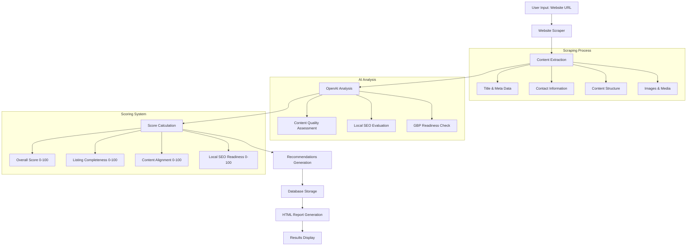

# Google Business Profile Audit System - Integration Template

## Overview

This template provides a complete guide for integrating the GBP (Google Business Profile) Audit System into your existing Vercel and Next.js website. The system analyzes websites and generates comprehensive audit reports with actionable recommendations for local SEO and Google Business Profile optimization.

## System Architecture

### Core Components

```
├── Frontend (Next.js)
│   ├── Toolbar Integration
│   ├── Audit Dashboard
│   ├── Results Display
│   └── Report Generation
├── Backend (FastAPI/Python)
│   ├── Website Scraping Service
│   ├── OpenAI Integration
│   ├── Audit Engine
│   └── Report Generator
├── Database (PostgreSQL/Supabase)
│   ├── Business Records
│   ├── Audit Results
│   └── User Management
└── Deployment (Vercel)
    ├── Frontend Deployment
    ├── API Routes
    └── Environment Configuration
```

## Quick Start Integration

### 1. Install Dependencies

```bash
# Frontend dependencies
npm install framer-motion react-hot-toast
npm install @types/node @types/react @types/react-dom

# Backend dependencies (if using Python backend)
pip install fastapi uvicorn beautifulsoup4 requests openai sqlalchemy
```

### 2. Environment Variables

Create `.env.local` in your project root:

```env
# OpenAI Configuration
OPENAI_API_KEY=your_openai_api_key_here

# Database Configuration (if using Supabase)
NEXT_PUBLIC_SUPABASE_URL=your_supabase_url
NEXT_PUBLIC_SUPABASE_ANON_KEY=your_supabase_anon_key
SUPABASE_SERVICE_ROLE_KEY=your_service_role_key

# API Configuration
NEXT_PUBLIC_API_BASE_URL=http://localhost:8000
```

## Frontend Integration

### 1. Toolbar Component Integration

Create a toolbar component that can be easily added to any page:

```typescript
// components/AuditToolbar.tsx
"use client";

import { useState } from 'react';
import { motion, AnimatePresence } from 'framer-motion';
import { toast } from 'react-hot-toast';

interface AuditToolbarProps {
  position?: 'top' | 'bottom' | 'right' | 'left';
  theme?: 'light' | 'dark';
}

export default function AuditToolbar({ 
  position = 'right', 
  theme = 'dark' 
}: AuditToolbarProps) {
  const [isOpen, setIsOpen] = useState(false);
  const [isLoading, setIsLoading] = useState(false);
  const [url, setUrl] = useState('');

  const handleAudit = async () => {
    if (!url) {
      toast.error('Please enter a website URL');
      return;
    }

    setIsLoading(true);
    try {
      const response = await fetch('/api/audit/run', {
        method: 'POST',
        headers: { 'Content-Type': 'application/json' },
        body: JSON.stringify({ url, source: 'toolbar' })
      });

      if (response.ok) {
        const result = await response.json();
        toast.success('Audit completed successfully!');
        // Handle result display or redirect
      } else {
        throw new Error('Audit failed');
      }
    } catch (error) {
      toast.error('Failed to run audit');
    } finally {
      setIsLoading(false);
    }
  };

  return (
    <>
      {/* Toolbar Trigger Button */}
      <motion.button
        className={`fixed z-50 ${getPositionClasses(position)} ${getThemeClasses(theme)}`}
        onClick={() => setIsOpen(true)}
        whileHover={{ scale: 1.05 }}
        whileTap={{ scale: 0.95 }}
      >
        <svg className="w-6 h-6" fill="none" stroke="currentColor" viewBox="0 0 24 24">
          <path strokeLinecap="round" strokeLinejoin="round" strokeWidth={2} 
                d="M9 19v-6a2 2 0 00-2-2H5a2 2 0 00-2 2v6a2 2 0 002 2h2a2 2 0 002-2zm0 0V9a2 2 0 012-2h2a2 2 0 012 2v10m-6 0a2 2 0 002 2h2a2 2 0 002-2m0 0V5a2 2 0 012-2h2a2 2 0 012 2v14a2 2 0 01-2 2h-2a2 2 0 01-2-2z" />
        </svg>
      </motion.button>

      {/* Audit Modal */}
      <AnimatePresence>
        {isOpen && (
          <motion.div
            className="fixed inset-0 bg-black bg-opacity-50 flex items-center justify-center z-50"
            initial={{ opacity: 0 }}
            animate={{ opacity: 1 }}
            exit={{ opacity: 0 }}
            onClick={() => setIsOpen(false)}
          >
            <motion.div
              className="bg-white rounded-lg p-6 max-w-md w-full mx-4"
              initial={{ scale: 0.9, opacity: 0 }}
              animate={{ scale: 1, opacity: 1 }}
              exit={{ scale: 0.9, opacity: 0 }}
              onClick={(e) => e.stopPropagation()}
            >
              <h3 className="text-lg font-semibold mb-4">Website Audit</h3>
              <input
                type="url"
                value={url}
                onChange={(e) => setUrl(e.target.value)}
                placeholder="Enter website URL"
                className="w-full px-3 py-2 border border-gray-300 rounded-md mb-4"
              />
              <div className="flex gap-2">
                <button
                  onClick={handleAudit}
                  disabled={isLoading}
                  className="flex-1 bg-blue-600 text-white py-2 px-4 rounded-md disabled:opacity-50"
                >
                  {isLoading ? 'Running Audit...' : 'Start Audit'}
                </button>
                <button
                  onClick={() => setIsOpen(false)}
                  className="px-4 py-2 border border-gray-300 rounded-md"
                >
                  Cancel
                </button>
              </div>
            </motion.div>
          </motion.div>
        )}
      </AnimatePresence>
    </>
  );
}

function getPositionClasses(position: string): string {
  switch (position) {
    case 'top': return 'top-4 right-4';
    case 'bottom': return 'bottom-4 right-4';
    case 'left': return 'top-1/2 left-4 transform -translate-y-1/2';
    case 'right': 
    default: return 'top-1/2 right-4 transform -translate-y-1/2';
  }
}

function getThemeClasses(theme: string): string {
  return theme === 'light' 
    ? 'bg-white text-gray-900 shadow-lg border'
    : 'bg-gray-900 text-white shadow-lg';
}
```

### 2. Adding Toolbar to Your Layout

```typescript
// app/layout.tsx or pages/_app.tsx
import AuditToolbar from '@/components/AuditToolbar';

export default function RootLayout({
  children,
}: {
  children: React.ReactNode;
}) {
  return (
    <html lang="en">
      <body>
        {children}
        <AuditToolbar position="right" theme="dark" />
      </body>
    </html>
  );
}
```

### 3. Audit Dashboard Page

```typescript
// app/audits/page.tsx
"use client";

import { useState, useEffect } from 'react';
import { motion } from 'framer-motion';

interface AuditResult {
  id: string;
  url: string;
  businessName: string;
  overallScore: number;
  auditDate: string;
  reportUrl: string;
}

export default function AuditsPage() {
  const [audits, setAudits] = useState<AuditResult[]>([]);
  const [loading, setLoading] = useState(true);

  useEffect(() => {
    fetchAudits();
  }, []);

  const fetchAudits = async () => {
    try {
      const response = await fetch('/api/audits');
      const data = await response.json();
      setAudits(data);
    } catch (error) {
      console.error('Failed to fetch audits:', error);
    } finally {
      setLoading(false);
    }
  };

  return (
    <div className="container mx-auto px-4 py-8">
      <h1 className="text-3xl font-bold mb-8">Website Audits</h1>
      
      {loading ? (
        <div className="text-center">Loading audits...</div>
      ) : (
        <div className="grid gap-6">
          {audits.map((audit, index) => (
            <motion.div
              key={audit.id}
              className="bg-white rounded-lg shadow-md p-6"
              initial={{ opacity: 0, y: 20 }}
              animate={{ opacity: 1, y: 0 }}
              transition={{ delay: index * 0.1 }}
            >
              <div className="flex justify-between items-start">
                <div>
                  <h3 className="text-xl font-semibold">{audit.businessName}</h3>
                  <p className="text-gray-600">{audit.url}</p>
                  <p className="text-sm text-gray-500">
                    {new Date(audit.auditDate).toLocaleDateString()}
                  </p>
                </div>
                <div className="text-right">
                  <div className={`text-2xl font-bold ${
                    audit.overallScore >= 80 ? 'text-green-600' :
                    audit.overallScore >= 60 ? 'text-yellow-600' : 'text-red-600'
                  }`}>
                    {audit.overallScore}/100
                  </div>
                  <a
                    href={audit.reportUrl}
                    target="_blank"
                    rel="noopener noreferrer"
                    className="inline-block mt-2 bg-blue-600 text-white px-4 py-2 rounded-md text-sm"
                  >
                    View Report
                  </a>
                </div>
              </div>
            </motion.div>
          ))}
        </div>
      )}
    </div>
  );
}
```

## Backend Integration

### 1. API Routes (Next.js App Router)

```typescript
// app/api/audit/run/route.ts
import { NextRequest, NextResponse } from 'next/server';

export async function POST(request: NextRequest) {
  try {
    const { url, businessName } = await request.json();

    // Validate URL
    if (!url) {
      return NextResponse.json({ error: 'URL is required' }, { status: 400 });
    }

    // Call your audit service
    const auditResult = await runWebsiteAudit(url, businessName);

    return NextResponse.json(auditResult);
  } catch (error) {
    console.error('Audit error:', error);
    return NextResponse.json(
      { error: 'Failed to run audit' },
      { status: 500 }
    );
  }
}

async function runWebsiteAudit(url: string, businessName?: string) {
  // Website scraping logic
  const websiteData = await scrapeWebsite(url);
  
  // OpenAI audit generation
  const auditResults = await generateAuditWithOpenAI(websiteData);
  
  // Save results to database
  const savedAudit = await saveAuditResults(auditResults);
  
  // Generate HTML report
  const reportUrl = await generateHTMLReport(auditResults);
  
  return {
    ...auditResults,
    reportUrl,
    auditId: savedAudit.id
  };
}
```

### 2. Website Scraping Service

```typescript
// lib/services/websiteScraper.ts
import * as cheerio from 'cheerio';

export interface WebsiteData {
  url: string;
  title: string;
  metaDescription: string;
  h1Tags: string[];
  h2Tags: string[];
  contactInfo: {
    phone?: string;
    email?: string;
    address?: string;
  };
  images: Array<{
    src: string;
    alt: string;
  }>;
  content: string;
}

export async function scrapeWebsite(url: string): Promise<WebsiteData> {
  try {
    const response = await fetch(url, {
      headers: {
        'User-Agent': 'Mozilla/5.0 (Windows NT 10.0; Win64; x64) AppleWebKit/537.36'
      }
    });
    
    const html = await response.text();
    const $ = cheerio.load(html);

    return {
      url,
      title: $('title').text().trim(),
      metaDescription: $('meta[name="description"]').attr('content') || '',
      h1Tags: $('h1').map((_, el) => $(el).text().trim()).get(),
      h2Tags: $('h2').map((_, el) => $(el).text().trim()).get(),
      contactInfo: extractContactInfo($),
      images: $('img').map((_, el) => ({
        src: $(el).attr('src') || '',
        alt: $(el).attr('alt') || ''
      })).get(),
      content: $('body').text().replace(/\s+/g, ' ').trim()
    };
  } catch (error) {
    console.error('Scraping error:', error);
    throw new Error('Failed to scrape website');
  }
}

function extractContactInfo($: cheerio.CheerioAPI) {
  const text = $('body').text();
  
  // Phone number extraction
  const phoneMatch = text.match(/(\(?\d{3}\)?[-.\s]?\d{3}[-.\s]?\d{4})/);
  
  // Email extraction
  const emailMatch = text.match(/([a-zA-Z0-9._%+-]+@[a-zA-Z0-9.-]+\.[a-zA-Z]{2,})/);
  
  return {
    phone: phoneMatch ? phoneMatch[1] : undefined,
    email: emailMatch ? emailMatch[1] : undefined,
    address: undefined // Implement address extraction logic
  };
}
```

### 3. OpenAI Audit Generation

```typescript
// lib/services/auditGenerator.ts
import OpenAI from 'openai';

const openai = new OpenAI({
  apiKey: process.env.OPENAI_API_KEY
});

export interface AuditResult {
  overallScore: number;
  listingCompletenessScore: number;
  contentAlignmentScore: number;
  localSeoReadinessScore: number;
  recommendations: {
    critical: string[];
    important: string[];
    suggested: string[];
  };
  analysisSummary: string;
}

export async function generateAuditWithOpenAI(websiteData: WebsiteData): Promise<AuditResult> {
  const prompt = createAuditPrompt(websiteData);
  
  const response = await openai.chat.completions.create({
    model: "gpt-4-turbo",
    messages: [
      {
        role: "system",
        content: "You are a Google Business Profile optimization specialist conducting a detailed audit."
      },
      {
        role: "user",
        content: prompt
      }
    ],
    temperature: 0.5,
    max_tokens: 2500
  });

  const content = response.choices[0].message.content;
  return JSON.parse(content || '{}');
}

function createAuditPrompt(websiteData: WebsiteData): string {
  return `
    Analyze this website data and provide a comprehensive Google Business Profile audit:

    Website URL: ${websiteData.url}
    Title: ${websiteData.title}
    Meta Description: ${websiteData.metaDescription}
    Contact Info: ${JSON.stringify(websiteData.contactInfo)}
    
    Content Summary: ${websiteData.content.substring(0, 1500)}

    Provide a JSON response with scores (0-100) and recommendations:
    {
      "overallScore": <number>,
      "listingCompletenessScore": <number>,
      "contentAlignmentScore": <number>,
      "localSeoReadinessScore": <number>,
      "recommendations": {
        "critical": [<strings>],
        "important": [<strings>],
        "suggested": [<strings>]
      },
      "analysisSummary": "<detailed analysis>"
    }
  `;
}
```

## Database Schema

### 1. SQL Schema

```sql
-- Businesses table
CREATE TABLE businesses (
    id SERIAL PRIMARY KEY,
    name VARCHAR(255) NOT NULL,
    website_url VARCHAR(500),
    place_id VARCHAR(255),
    phone VARCHAR(50),
    address TEXT,
    created_at TIMESTAMP DEFAULT CURRENT_TIMESTAMP,
    updated_at TIMESTAMP DEFAULT CURRENT_TIMESTAMP
);

-- Audits table
CREATE TABLE audits (
    id SERIAL PRIMARY KEY,
    business_id INTEGER REFERENCES businesses(id),
    audit_date TIMESTAMP DEFAULT CURRENT_TIMESTAMP,
    overall_score FLOAT,
    listing_completeness_score FLOAT,
    content_alignment_score FLOAT,
    local_seo_readiness_score FLOAT,
    recommendations JSONB,
    analysis_summary TEXT,
    report_url VARCHAR(500),
    audit_source VARCHAR(50) DEFAULT 'website'
);

-- Create indexes
CREATE INDEX idx_audits_business_id ON audits(business_id);
CREATE INDEX idx_audits_date ON audits(audit_date);
CREATE INDEX idx_businesses_website ON businesses(website_url);
```

### 2. Prisma Schema (Alternative)

```prisma
// prisma/schema.prisma
model Business {
  id          Int      @id @default(autoincrement())
  name        String
  websiteUrl  String?  @map("website_url")
  placeId     String?  @map("place_id")
  phone       String?
  address     String?
  createdAt   DateTime @default(now()) @map("created_at")
  updatedAt   DateTime @updatedAt @map("updated_at")
  audits      Audit[]

  @@map("businesses")
}

model Audit {
  id                        Int      @id @default(autoincrement())
  businessId                Int      @map("business_id")
  auditDate                 DateTime @default(now()) @map("audit_date")
  overallScore              Float?   @map("overall_score")
  listingCompletenessScore  Float?   @map("listing_completeness_score")
  contentAlignmentScore     Float?   @map("content_alignment_score")
  localSeoReadinessScore    Float?   @map("local_seo_readiness_score")
  recommendations           Json?
  analysisSummary           String?  @map("analysis_summary")
  reportUrl                 String?  @map("report_url")
  auditSource               String   @default("website") @map("audit_source")
  business                  Business @relation(fields: [businessId], references: [id])

  @@map("audits")
}
```

## How the Audit System Works

### 1. Data Flow Architecture



### 2. Component Breakdown

#### A. Website Scraping Engine
- **Purpose**: Extracts comprehensive data from target websites
- **Technologies**: Cheerio, Puppeteer (for dynamic content)
- **Data Extracted**:
  - Meta information (title, description)
  - Contact details (phone, email, address)
  - Content structure (headings, text)
  - Images and media
  - Internal page structure

#### B. AI Analysis Engine
- **Purpose**: Analyzes scraped data using OpenAI GPT-4
- **Process**:
  1. Formats website data into structured prompt
  2. Sends to OpenAI API with specific audit instructions
  3. Receives JSON-formatted analysis results
  4. Validates and parses response

#### C. Scoring Algorithm
- **Overall Score**: Weighted average of all components
- **Listing Completeness**: How complete the GBP listing would be
- **Content Alignment**: How well website content aligns with GBP best practices
- **Local SEO Readiness**: Technical optimization for local search

#### D. Report Generation System
- **HTML Reports**: Comprehensive, branded audit reports
- **PDF Export**: Professional reports for client delivery
- **Dashboard Integration**: Real-time results display

### 3. Integration Points

#### A. Toolbar Integration
```typescript
// Add to any page with minimal configuration
<AuditToolbar 
  position="right"
  theme="dark"
  autoTrigger={false}
  customStyles={{}}
/>
```

#### B. API Integration
```typescript
// Direct API calls for custom implementations
const auditResult = await fetch('/api/audit/run', {
  method: 'POST',
  body: JSON.stringify({ url: 'https://example.com' })
});
```

#### C. Webhook Integration
```typescript
// For asynchronous processing
const webhook = await fetch('/api/audit/webhook', {
  method: 'POST',
  body: JSON.stringify({
    url: 'https://example.com',
    callbackUrl: 'https://yoursite.com/audit-complete'
  })
});
```

## Deployment Configuration

### 1. Vercel Deployment

```json
// vercel.json
{
  "functions": {
    "app/api/audit/run/route.ts": {
      "maxDuration": 300
    }
  },
  "env": {
    "OPENAI_API_KEY": "@openai-api-key",
    "DATABASE_URL": "@database-url"
  }
}
```

### 2. Environment Setup

```bash
# Install Vercel CLI
npm i -g vercel

# Deploy
vercel --prod

# Set environment variables
vercel env add OPENAI_API_KEY
vercel env add DATABASE_URL
```

## Customization Options

### 1. Branding Customization

```typescript
// lib/config/branding.ts
export const brandingConfig = {
  companyName: "Your Company Name",
  logo: "/your-logo.png",
  primaryColor: "#your-color",
  contactInfo: {
    phone: "your-phone",
    email: "your-email",
    website: "your-website"
  }
};
```

### 2. Scoring Weights

```typescript
// lib/config/scoring.ts
export const scoringWeights = {
  listingCompleteness: 0.4,
  contentAlignment: 0.3,
  localSeoReadiness: 0.3
};
```

### 3. Custom Prompts

```typescript
// lib/config/prompts.ts
export const auditPrompts = {
  system: "Your custom system prompt",
  analysis: "Your custom analysis instructions",
  recommendations: "Your custom recommendation guidelines"
};
```

## Security Considerations

### 1. API Rate Limiting

```typescript
// lib/middleware/rateLimit.ts
import { NextRequest } from 'next/server';

export function rateLimit(request: NextRequest) {
  // Implement rate limiting logic
  const userIP = request.ip;
  // Check against rate limit store
}
```

### 2. Input Validation

```typescript
// lib/validation/audit.ts
import { z } from 'zod';

export const auditRequestSchema = z.object({
  url: z.string().url(),
  businessName: z.string().optional()
});
```

### 3. Data Sanitization

```typescript
// lib/utils/sanitize.ts
export function sanitizeWebsiteData(data: any) {
  // Remove sensitive information
  // Validate data structure
  // Clean HTML content
}
```

## Monitoring and Analytics

### 1. Performance Tracking

```typescript
// lib/analytics/performance.ts
export function trackAuditPerformance(auditId: string, metrics: {
  scrapingTime: number;
  analysisTime: number;
  totalTime: number;
}) {
  // Send to analytics service
}
```

### 2. Error Monitoring

```typescript
// lib/monitoring/errors.ts
export function logAuditError(error: Error, context: any) {
  // Send to error monitoring service (Sentry, etc.)
}
```

## Support and Maintenance

### 1. Health Checks

```typescript
// app/api/health/route.ts
export async function GET() {
  const checks = {
    database: await checkDatabase(),
    openai: await checkOpenAI(),
    scraping: await checkScrapingService()
  };
  
  return Response.json(checks);
}
```

### 2. Automated Testing

```typescript
// tests/audit.test.ts
describe('Audit System', () => {
  test('should scrape website successfully', async () => {
    const result = await scrapeWebsite('https://example.com');
    expect(result.title).toBeDefined();
  });
  
  test('should generate audit scores', async () => {
    const audit = await generateAudit(mockWebsiteData);
    expect(audit.overallScore).toBeGreaterThan(0);
  });
});
```

## Conclusion

This template provides a complete foundation for integrating the GBP Audit System into your Vercel and Next.js website. The system is designed to be:

- **Scalable**: Handle multiple concurrent audits
- **Customizable**: Easy to brand and modify
- **Reliable**: Error handling and monitoring built-in
- **Professional**: Generate high-quality reports
- **User-friendly**: Simple toolbar integration

For support or questions about implementation, refer to the individual component documentation or create an issue in the project repository. 